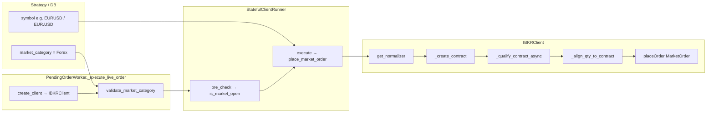

# Architecture Patterns — IBKR Forex Integration

**Domain:** Live trading — Interactive Brokers (ib_insync)  
**Researched:** 2026-04-09  
**Scope:** How Forex (IDEALPRO) should integrate with the existing `IBKRClient` and surrounding execution stack.

## Recommended Architecture

Forex is **not** a parallel subsystem: it extends the same **contract → qualify → RTH → normalize qty → MarketOrder** pipeline that US stocks and HK shares already use. The only structural fork is **`_create_contract`**: stocks use `ib_insync.Stock`; Forex uses `ib_insync.Forex` (typically `exchange='IDEALPRO'`). Everything upstream and downstream of that fork stays in the **BaseStatefulClient + StatefulClientRunner + PendingOrderWorker** pattern.



### Component Boundaries

| Component | Responsibility | Forex-specific note |
|-----------|----------------|---------------------|
| **`IBKRClient`** | Single entry for IB orders, RTH, quotes, limits | Branch `Forex` in `_create_contract`; extend `supported_market_categories`; adjust `_get_tif_for_signal` if Forex TIF rules differ from US/HK. |
| **`ibkr_trading/symbols.py`** | Map system symbol → IB contract fields | New branch: parse `EURUSD` / `EUR.USD` → `(pair, IDEALPRO, …)` for `Forex()`. |
| **`order_normalizer` (`get_normalizer`)** | Pre-flight qty check + coarse rounding | **`Forex` already maps to `ForexNormalizer`** (floor). No factory change required. |
| **`_align_qty_to_contract`** | IBKR `sizeIncrement` / `minSize` alignment | **Stock and Forex** — same code path; Forex contracts expose increments via `reqContractDetailsAsync`. |
| **`trading_hours.is_rth_check`** | Session test from `liquidHours` | **Unchanged** — Forex uses same `ContractDetails` path; 24/5 behavior comes from IBKR’s `liquidHours`. |
| **`StatefulClientRunner`** | RTH pre-check (open signals), then `place_market_order` | **Unchanged** — resolves “market” string from `market_category` first (see below). |
| **`PendingOrderWorker`** | Build `OrderContext`, `create_client`, `validate_market_category`, `get_runner` | **Unchanged logic** — must allow `market_category=Forex` with `ibkr-paper` / `ibkr-live` (not blocked by crypto-only rules). |
| **`factory.create_client` / `get_runner`** | IBKR singleton + `StatefulClientRunner` | **Unchanged** — Forex uses same IBKR client as stocks. |

## Stock vs Forex Contract Flow

| Stage | USStock / HShare | Forex (target) |
|-------|------------------|----------------|
| **Symbol input** | `AAPL`, `00700.HK` | `EURUSD`, `EUR.USD`, etc. (project convention to be fixed in `normalize_symbol`) |
| **`normalize_symbol`** | → `(ib_symbol, SMART\|SEHK, USD\|HKD)` | → `(pair or base+quote, IDEALPRO, quote ccy)` aligned with `ib_insync.Forex` constructor |
| **Contract object** | `Stock(symbol=…, exchange=…, currency=…)` | `Forex(pair='EURUSD')` or `Forex(symbol='EUR', currency='USD', exchange='IDEALPRO')` (choose one style and keep it consistent) |
| **Qualify** | `qualifyContractsAsync` | Same |
| **RTH** | `reqContractDetailsAsync` → `liquidHours` | Same |
| **Qty meaning** | Shares | **Base currency units** on IDEALPRO (e.g. EUR notional for EUR.USD), then increment alignment |
| **Normalizer** | `USStockNormalizer` / `HShareNormalizer` | `ForexNormalizer` — `math.floor` before IB increment alignment |
| **TIF** | `_get_tif_for_signal`: DAY open; IOC close for US; HShare close → DAY | **Decision:** treat like US (DAY / IOC) unless IBKR rejects — document in implementation phase |

## Integration Points (Major)

### 1. `IBKRClient.supported_market_categories`

- **Today:** `frozenset({"USStock", "HShare"})`  
- **Change:** add `"Forex"`.  
- **Why:** `PendingOrderWorker` calls `client.validate_market_category(market_category)` for every `BaseStatefulClient`. Without this, live orders with `market_category=Forex` fail before the runner runs.

### 2. `IBKRClient._create_contract` (and call sites)

- **Today:** always `Stock(...)`.  
- **Change:** if `market_type == "Forex"` (the parameter name is historical — see runner note below), build `Forex` from `normalize_symbol` output.  
- **Call sites using `_create_contract`:** `is_market_open`, `place_market_order`, `place_limit_order`, `get_quote` — all benefit from one branch.

### 3. `normalize_symbol` / optional `parse_symbol` (`ibkr_trading/symbols.py`)

- **Today:** US + HK only; unknown `market_type` falls through to US stock tuple.  
- **Change:** explicit `Forex` branch so mis-tagged symbols do not silently become `Stock` on SMART.  
- **`parse_symbol`:** extend if auto-detection of FX pairs is required for APIs or tooling (optional for milestone if all paths pass `market_category=Forex`).

### 4. `ForexNormalizer` + `_align_qty_to_contract`

- **ForexNormalizer:** already registered in `get_normalizer("Forex")` — **no change** for basic integration.  
- **`_align_qty_to_contract`:** already uses `sizeIncrement` / `minSize` — **no change**; ensures floor from normalizer + IB increment stay consistent.

### 5. `_get_tif_for_signal`

- **Today:** IOC on close for US; HShare close forced to DAY.  
- **Forex:** add an explicit branch (e.g. same as US, or DAY for both if IOC unsupported on IDEALPRO for your account — **verify with TWS/paper** during implementation).

### 6. `StatefulClientRunner`

- **pre_check:** `is_market_open(symbol, market_type)` where `market_type` is resolved as:

```32:38:backend_api_python/app/services/live_trading/runners/stateful_runner.py
        market_type = str(
            ctx.market_category or
            ctx.payload.get("market_type") or
            ctx.payload.get("market_category") or
            ctx.exchange_config.get("market_type") or
            ctx.exchange_config.get("market_category") or
            ""
        ).strip()
```

- **Important:** **`market_category` is first** — for Forex strategies, DB/config should set `market_category=Forex`. The worker’s generic `OrderContext.market_type` (often `swap` for crypto) does **not** override this for execution.
- **execute:** same resolution → passed to `place_market_order(..., market_type=…)` which is really “execution market category” for IBKR.

### 7. `PendingOrderWorker._execute_live_order`

- Loads `market_category` from strategy config (`load_strategy_configs`).  
- Blocks only `AShare` / `Futures` for live; **Forex is not in that list**.  
- Crypto exchanges have an `allowed` map; **IBKR is not in `_EXCHANGE_MARKET_RULES`**, so no new rule row is required for Forex.  
- Flow: `create_client` → `validate_market_category` → `StatefulClientRunner.pre_check` → `execute`.

## Data Flow: Forex Orders vs Stock Orders

**Direction:** `pending_orders` row → worker builds `OrderContext` → `IBKRClient` (same singleton as stocks) → IB Gateway.

| Step | Stock | Forex |
|------|-------|-------|
| 1 | `market_category` = USStock / HShare | `market_category` = Forex |
| 2 | `validate_market_category` passes | Same once `Forex` ∈ `supported_market_categories` |
| 3 | RTH: `Stock` + `liquidHours` | `Forex` + `liquidHours` (24/5 sessions from IB) |
| 4 | `get_normalizer` → US/HK normalizer | `get_normalizer("Forex")` → `ForexNormalizer` |
| 5 | `_create_contract` → Stock | `_create_contract` → Forex |
| 6 | `MarketOrder` + TIF | Same API; TIF policy may differ |
| 7 | Async fills → `_handle_fill` / `IBKROrderContext` | Same (symbol string should match position reporting — confirm `get_positions` / DB keys if mixed portfolios) |

## Files Likely to Touch (Modification Points)

| File | Change |
|------|--------|
| `backend_api_python/app/services/live_trading/ibkr_trading/client.py` | `supported_market_categories`; `_create_contract`; `_get_tif_for_signal` (Forex branch); optionally docstrings |
| `backend_api_python/app/services/live_trading/ibkr_trading/symbols.py` | `normalize_symbol` (+ optional `parse_symbol`, `format_display_symbol`) for Forex |
| `backend_api_python/tests/test_exchange_engine.py` | Expected `supported_market_categories` includes Forex |
| `backend_api_python/tests/test_ibkr_client.py` | Contract creation / place order / RTH mocks for Forex |
| `backend_api_python/app/services/live_trading/factory.py` | Docstring only (“US/HK stocks + Forex”) — **no factory logic change** unless new exchange id (not required) |

**Explicitly no change for milestone:**  
- `order_normalizer/__init__.py` — `Forex` already wired.  
- `StatefulClientRunner`, `PendingOrderWorker` — behavior already correct once client accepts `Forex`.  
- `ibkr_trading/order_normalizer/__init__.py` — re-exports only.

## Suggested Build Order (Dependencies)

1. **`symbols.py` (Forex branch)** — Pure functions, unit-testable without TWS.  
2. **`_create_contract` + `supported_market_categories`** — Wrong contract is the highest-risk bug.  
3. **`_get_tif_for_signal`** — Quick follow-up after first paper order attempt.  
4. **Integration tests** — Mock `ib_insync` / contract details as in existing `test_ibkr_client.py`.  
5. **E2E paper** — Single pair (e.g. EURUSD), open + close, verify fills and position records.  
6. **Optional:** `parse_symbol`, API routes (`routes/ibkr.py`), portfolio display if Forex symbols need special formatting.

## Anti-Patterns to Avoid

- **Reusing `Stock` with a pseudo-symbol for FX** — breaks qualification, RTH, and increments.  
- **Adding a second IBKR client for Forex** — duplicates connection/state; extend the existing `IBKRClient`.  
- **Depending on worker `market_type` alone** — runner prioritizes `market_category`; strategy config must be consistent.  
- **Skipping `validate_market_category`** — would require bypassing `BaseStatefulClient` contract; keep the gate.

## Scalability Considerations

| Concern | Notes |
|---------|--------|
| Mixed portfolio | Same client handles multiple `secType`s; ensure position/trade records use stable symbol keys for FX. |
| Cache keys | `_lot_size_cache` / `_rth_details_cache` keyed by `conId` — Forex contracts get distinct `conId`s; no collision with stocks. |
| Rate / load | Forex 24/5 may increase RTH check frequency; same as stocks per order. |

## Sources

- Code: `backend_api_python/app/services/live_trading/ibkr_trading/client.py`, `symbols.py`, `runners/stateful_runner.py`, `pending_order_worker.py`, `order_normalizer/__init__.py`, `base.py`  
- Project: `.planning/PROJECT.md` (IDEALPRO, `Forex` constructor notes)  
- **Confidence:** **HIGH** for control flow and file touch points (directly read from repo). **MEDIUM** for IBKR TIF behavior on IDEALPRO — validate in paper trading.

---

*Architecture research for IBKR Forex milestone — 2026-04-09*
